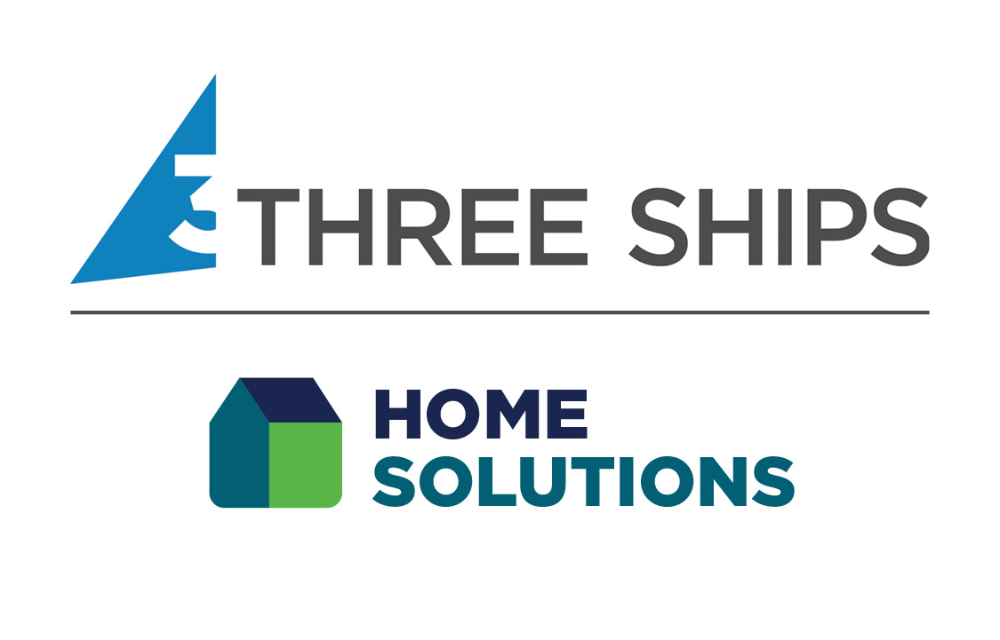
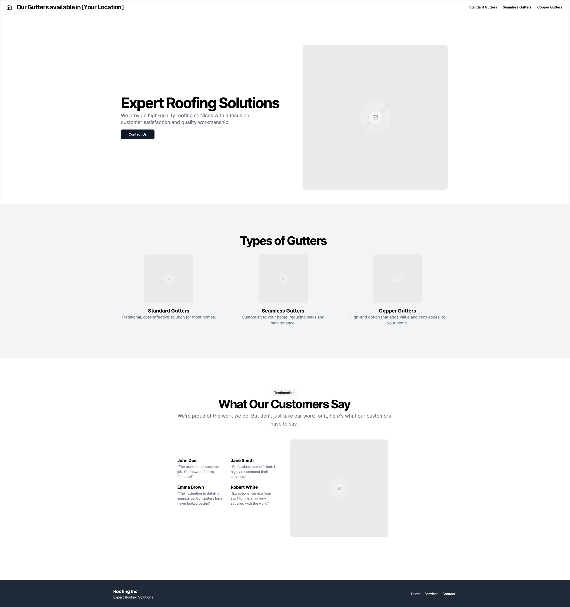

# Home Solutions Developer Evaluation
Welcome to the Home Solutions Developer Evaluation! Keep reading to understand why we have this process and what it measures, or if you're returning skip ahead to [the setup](#the-setup) section.

## The Why
The goal of this project is to evaluate your technical skills, problem-solving abilities, and familiarity with modern development practices within the WordPress ecosystem. You are expected to set up a WordPress site from scratch, contained within a Docker environment. The site should feature a home page and product pages, with a focus on the structure and efficiency of your JavaScript and CSS quality. You may use the classic editor or gutenberg, but our team primarily focuses on Block based development so extra points for incorporating that.

This is not meant to be difficult, and it should not take an inordinate amount of time. Therefore, there is no flashy, nor ground shattering development happening here. Rather, we use this as a tool to evaluate how a candidate approaches a site build, what tools they reach for, how they think through structure, attention to detail, and quality of code.

The materials given to you are detailed enough to accomplish the goal while leaving some breathing room for personal choice and style. This is to test your resourcefulness and your ability to improvise where necessary. Make your choices and own them.

If you feel you have spent a significant amount of time on the evaluation and have yet to complete it, please push up what you have completed and send us an email. If you find something in the requirements that you do not have experience with and can’t complete, skip it.

## The Brief
We’re an up-and-coming gutter company and just entering the market. We want to launch with a small footprint and minimal lift, so we’ll start with two types of pages for testing viability . The first is a landing page that should have a catchy masthead, a section that references our various gutter models, and a testimonials section. The other page should be an individual gutters page that shows a description of the gutter and price with a button for checking out. We’ll use a third party for checking out so no need to build a page for the checkout flow, we just need to be able to link out from the checkout button. The two pages should have a consistent header and footer. We’ve had our design team mock up a quick wire frame for this to give you guidance on what we’re looking for. Don’t worry about the images and content for each page, just use what we have for now in the comps as we’ll edit these later, placeholders are fine!

## The Requirements
### Theme Development
Develop a WordPress theme from scratch. The theme should be responsive and follow best practices for web performance and accessibility. You have flexibility in how you structure the files, how you bundle the assets, and how you approach global elements, and whether you need custom post types. We've included the BlankSlate theme for convenience in getting started, but it's highly encouraged to change the project structure.

### Home Page and Product Page
**Home Page:** Translate the needs of the brief into a home page template that allows a user to control the content via the admin. This page is to entice the customer into exploring the product offerings.

**Product Page:** Create individual product pages for each gutter. In the mockup we’ve included the information these pages should include.

### JavaScript and CSS
Demonstrate how you structure and bundle your JavaScript and CSS. This could include built in tooling or custom pipelines. This is an excellent area to demonstrate your style of architecting frontend projects, and it’s recommended to use tooling that you’d implement in real sites.

### Version Control and Documentation
Use Git for version control. You are welcome to fork this repository as a starting place, and we've included a docker file for easy local setup. Structure your commits in a logical and descriptive manner. Host the project on GitHub (or a similar platform) and include a README.md file with clear instructions on how to set up and run your project, as well as any other documentation that you deem necessary for understanding your work and rationale behind choices.

### Deliverables
- A GitHub repository link containing all the code and documentation for your project.
- A sql dump of the database for the WordPress site.
- A brief explanation of your design and architecture choices, including how you approached the project requirements and any challenges you faced.

### Extra Credit
Develop at least two custom Gutenberg blocks that can be used within your site. These could be for specific functionality or layout purposes related to your site's content. Consider creating blocks that enhance the content management experience, such as a customized gallery or a block for displaying posts from your custom post type.

## The Mockup
Higher fidelity PNGs can be found in the `design` folder.

### Home Page

### Product Page

## The Evaluation
**Technical Proficiency:** Sophistication of the setup, code quality, use of modern development practices.

**Problem-Solving and Creativity:** Ability to implement functional and aesthetically pleasing web pages and to make clear decisions in the face of unknowns.

**Code Organization and Scalability:** Logical structuring of code, encapsulation and keeping code DRY, use of version control, and documentation.

**Performance and Best Practices:** Optimization JavaScript and CSS, clean and structured PHP, adherence to web performance best practices.

## The Timeline
Please complete the project within 1 week of being sent this material. Please email your contact at Home Solutions with a link to the github repository so that we can review. If you have not completed pieces of work at this point please send as is. We look forward to reviewing your work!

## The Setup
We provide a docker file to get you up and running quickly and to take some of the pain of local development out of this process. This also

### Prerequisites
- [Docker](https://www.docker.com/get-started)
- [Docker Compose](https://docs.docker.com/compose/install/)

### Running the Project
1. Clone the repository
2. Run `docker-compose up` from the root of the project
3. Visit `http://localhost` in your browser to access the WordPress site
4. Follow the WordPress installation instructions to set up your site
5. Activate the `eval` theme and begin development

